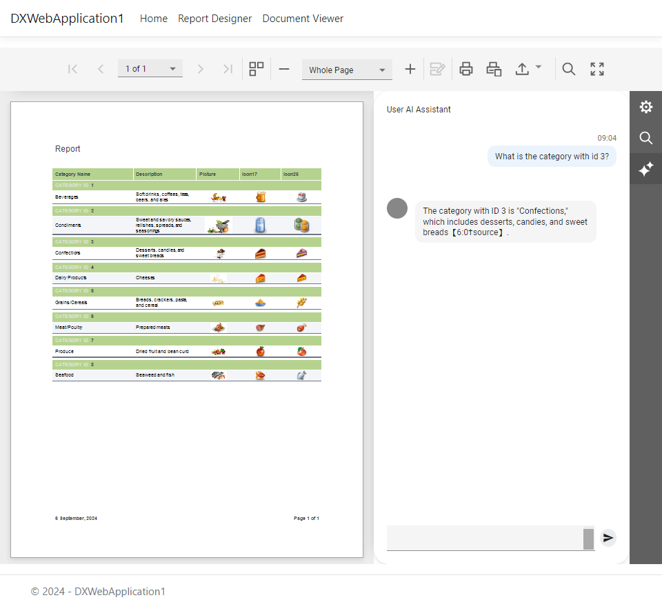
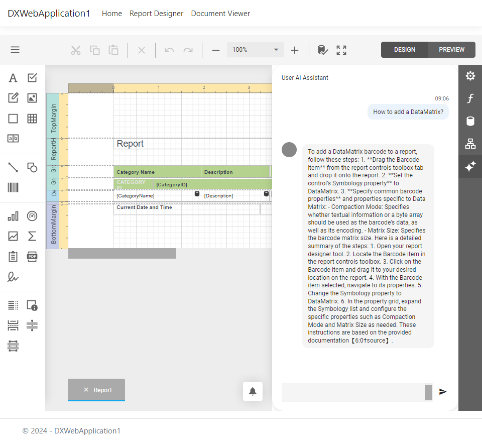

<!-- default badges list -->
[](https://supportcenter.devexpress.com/ticket/details/T1252182)
[](https://docs.devexpress.com/GeneralInformation/403183)
[](#does-this-example-address-your-development-requirementsobjectives)
<!-- default badges end -->
# Reporting for ASP.NET Core - Integrate AI Assistant based on Azure OpenAI

This example is an ASP.NET Core application with integrated DevExpress Reports and an AI assistant. User requests and assistant responses are displayed on-screen using the DevExtreme `dxChat` component.

The AI assistant's role depends on the associated DevExpress Reports component:

- **Data Analysis Assistant**: An assistant for the DevExpress *Web Document Viewer*. This assistant analyzes report content and answers questions related to information within the report.
- **User Interface Assistant**: An assistant for the DevExpress *Web Report Designer*. This assistant explains how to use the Designer UI to accomplish various tasks. Responses are based on information from [end-user documentation](https://github.com/DevExpress/dotnet-eud) for DevExpress Web Reporting components.

**Please note that AI Assistant initialization takes time. The assistant tab appears once Microsoft Azure scans the source document on the server side.**

> [!NOTE]
> To run this project with an Early Access Preview build (EAP), install npm packages:
>
> ```
>	npm install --legacy-peer-deps
> ```

## Implementation Details

### Common Settings

#### Add Personal Keys

You need to create an Azure OpenAI resource in the Azure portal to use AI Assistants for DevExpress Reporting. Refer to the following help topic for details: [Microsoft - Create and deploy an Azure OpenAI Service resource](https://learn.microsoft.com/en-us/azure/ai-services/openai/how-to/create-resource?pivots=web-portal).

Once you obtain a private endpoint and an API key, open [EnvSettings.cs](./CS/ReportingApp/EnvSettings.cs) and replace `OPENAI_ENDPOINT` and `OPENAI_APIKEY` values in the code below:

```cs
public static class EnvSettings {
        public static string AzureOpenAIEndpoint { get { return Environment.GetEnvironmentVariable("OPENAI_ENDPOINT"); } }
        public static string AzureOpenAIKey { get { return Environment.GetEnvironmentVariable("OPENAI_APIKEY"); } }
        public static string DeploymentName { get { return "GPT4o"; } } //Gpt35Turbo, gpt35turbo16k, GPT4, GPT4o
}
```

#### Register AI Services

Register AI services in your application. Add the following code to the _Program.cs_ file:

```cs
using DevExpress.AIIntegration;
// ...
builder.Services.AddDevExpressAI((config) => {
    var client = new AzureOpenAIClient(new Uri(EnvSettings.AzureOpenAIEndpoint), new AzureKeyCredential(EnvSettings.AzureOpenAIKey));
    var deployment = EnvSettings.DeploymentName;
    config.RegisterChatClientOpenAIService(client, deployment);
    config.RegisterOpenAIAssistants(client, deployment);
});
```

Files to Review: 
- [Program.cs](./CS/ReportingApp/Program.cs)
- [EnvSettings.cs](./CS/ReportingApp/EnvSettings.cs)

#### AI Assistant Provider
 
On the server side, the `AIAssistantProvider` service manages assistants. An `IAIAssistantFactory` instance creates assistants with keys specified in previous steps.
 
``` 
public interface IAIAssistantProvider {
    IAIAssistant GetAssistant(string assistantName);
    Task<string> CreateAssistant(AssistantType assistantType, Stream data);
    Task<string> CreateAssistant(AssistantType assistantType);
    void DisposeAssistant(string assistantName);
}
```

Files to Review: 
- [AIAssistantProvider.cs](./CS/ReportingApp/Services/AIAssistantProvider.cs)
- [IAIAssistantProvider.cs](./CS/ReportingApp/Services/IAIAssistantProvider.cs)


### Web Document Viewer (Document Assistant)

The following image displays Web Document Viewer UI implemented in this example. The AI Assistant tab uses a `dxChat` component to display requests and responses:



#### Add a New Tab

On the `BeforeRender` event, add a new tab (a container for the assistant interface):

```cshtml
@model DevExpress.XtraReports.Web.WebDocumentViewer.WebDocumentViewerModel
@await Html.PartialAsync("_AILayout")
<script>
    let aiTab;
    function BeforeRender(sender, args) {
        const previewModel = args;
        const reportPreview = previewModel.reportPreview;

        aiTab = createAssistantTab();
        const model = aiTab.model;
        previewModel.tabPanel.tabs.push(aiTab);
        // ...
    }
</script>

@{
    var viewerRender = Html.DevExpress().WebDocumentViewer("DocumentViewer")
        .Height("100%")
        .ClientSideEvents(configure => {
            configure.BeforeRender("BeforeRender");
        })
        .Bind(Model);
    @viewerRender.RenderHtml()
}
@* ... *@
```

#### Access the Assistant

Once the document is ready, the `DocumentReady` event handler sends a request to the server and obtains the assistant's ID:

```js
async function DocumentReady(sender, args) {
    const response = await sender.PerformCustomDocumentOperation(null, true);
    if (response.customData) {
        aiTab.model.chatId = response.customData;
        aiTab.visible = true;
    }
}
```

The [PerformCustomDocumentOperation](https://docs.devexpress.com/XtraReports/js-ASPxClientWebDocumentViewer?p=netframework#js_aspxclientwebdocumentviewer_performcustomdocumentoperation) method exports the report to PDF and creates an assistant based on the exported document. See [AIDocumentOperationService.cs]() for implementation details.

#### Communicate with the Assistant

Each time a user sends a message, the `onMessageSend` event handler passes the request to the assistant:

```js
//...
onMessageSend: (e) => {
    const instance = e.component;
    const formData = new FormData();
    formData.append('text', e.message.text);
    formData.append('chatId', model.chatId);
    fetch(`/AI/GetAnswer`, {
        method: 'POST',
        body: formData
    }).then((x) => {
        x.text().then((res) => {
            instance.renderMessage({
                text: res,
                author: { id: 'Assistant' }
            }, { id: 'Assistant' });
        });
    });
}
// ...
```

`AIController.GetAnswer` receives answers from the assistant.

#### Files to Review:

- [DocumentViewer.cshtml](./CS/ReportingApp/Views/Home/DocumentViewer.cshtml)
- [AIDocumentOperationService.cs](CS/ReportingApp/Services/AIDocumentOperationService.cs)
- [AIController.cs](./CS/ReportingApp/Controllers/AIController.cs)
- [aiIntegration.js](./CS/ReportingApp/wwwroot/js/aiIntegration.js)

### Web Report Designer (User Assistant)

The following image displays Web Report Designer UI implemented in this example. The AI Assistant tab uses a `dxChat` component to display requests and responses:



#### Add a New Tab

On the `BeforeRender` event, add a new tab (a container for the assistant interface):

```cshtml
@model DevExpress.XtraReports.Web.ReportDesigner.ReportDesignerModel
<script>
    async function BeforeRender(sender, args) {

        const tab = createAssistantTab(chatId);
        args.tabPanel.tabs.push(tab);
    }
</script>

@await Html.PartialAsync("_AILayout")
@{
    var designerRender = Html.DevExpress().ReportDesigner("reportDesigner")
        .Height("100%")
        .ClientSideEvents(configure => {
            configure.BeforeRender("BeforeRender");
        })
        .Bind(Model);
    @designerRender.RenderHtml()
}

@section Scripts {
    @* ... *@
    <script src="~/js/aiIntegration.js"></script>
    @designerRender.RenderScripts()
}
@* ... *@
```

#### Access the Assistant

On the `BeforeRender` event, send a request to `AIController` to create the assistant:

```js
async function BeforeRender(sender, args) {
    const result = await fetch(`/AI/CreateUserAssistant`);
}
```

The `AIAssistantProvider` service creates an assistant using the provided PDF documentation (the *documentation.pdf* file):

```cs
// ...
public async Task<string> CreateAssistant(AssistantType assistantType, Stream data) {
    var assistantName = Guid.NewGuid().ToString();
    var assistant = await assistantFactory.CreateAssistant(assistantName);
    Assistants.TryAdd(assistantName, assistant);
    var prompt = GetPrompt(assistantType);
    if(assistantType == AssistantType.UserAssistant) {
        await LoadDocumentation(assistant, prompt);
    } 
    return assistantName;
}
```
#### Communicate with the Assistant

Each time a user sends a message, the `onMessageSend` event handler passes the request to the assistant:

```js
//...
onMessageSend: (e) => {
    const instance = e.component;
    const formData = new FormData();
    formData.append('text', e.message.text);
    formData.append('chatId', model.chatId);
    fetch(`/AI/GetAnswer`, {
        method: 'POST',
        body: formData
    }).then((x) => {
        x.text().then((res) => {
            instance.renderMessage({
                text: res,
                author: { id: 'Assistant' }
            }, { id: 'Assistant' });
        });
    });
}
// ...
```

`AIController.GetAnswer` receives answers from the specified assistant.

#### Files to Review:

- [ReportDesigner.cshtml](./CS/ReportingApp/Views/Home/ReportDesigner.cshtml)
- [AIDocumentOperationService.cs](./CS/ReportingApp/Services/AIDocumentOperationService.cs)
- [AIController.cs](./CS/ReportingApp/Controllers/AIController.cs)
- [aiIntegration.js](./CS/ReportingApp/wwwroot/js/aiIntegration.js)

## More Examples

- [Rich Text Editor and HTML Editor for Blazor - How to integrate AI-powered extensions](https://github.com/DevExpress-Examples/blazor-ai-integration-to-text-editors)
- [AI Chat for Blazor - How to add DxAIChat component in Blazor, MAUI, WPF, and WinForms applications](https://github.com/DevExpress-Examples/devexpress-ai-chat-samples)

<!-- feedback -->
## Does this example address your development requirements/objectives?

[](https://www.devexpress.com/support/examples/survey.xml?utm_source=github&utm_campaign=web-reporting-integrate-ai-assistant&~~~was_helpful=yes) [](https://www.devexpress.com/support/examples/survey.xml?utm_source=github&utm_campaign=web-reporting-integrate-ai-assistant&~~~was_helpful=no)

(you will be redirected to DevExpress.com to submit your response)
<!-- feedback end -->
