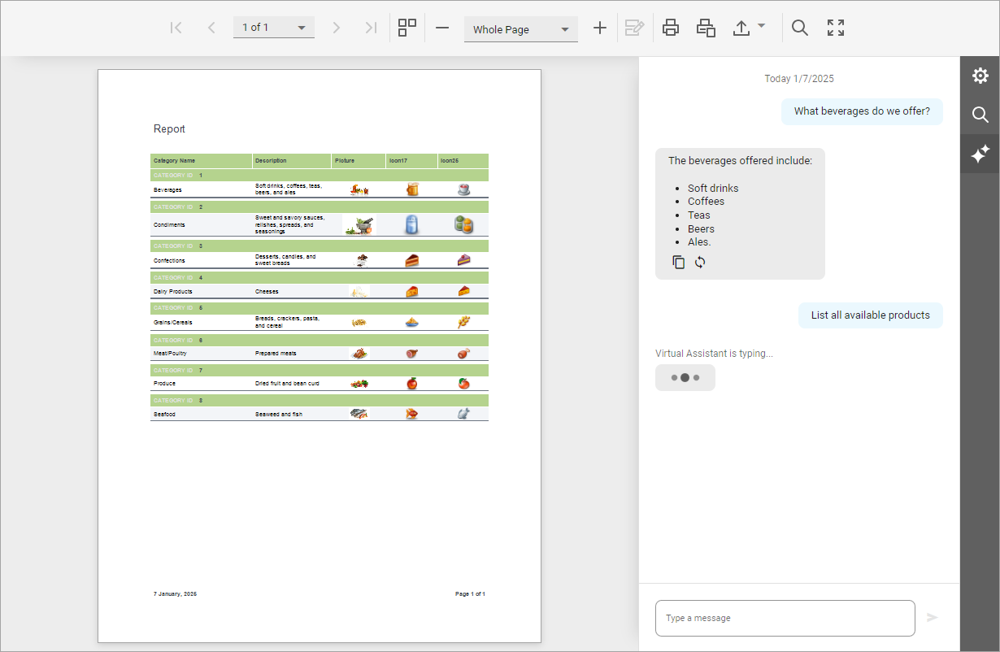
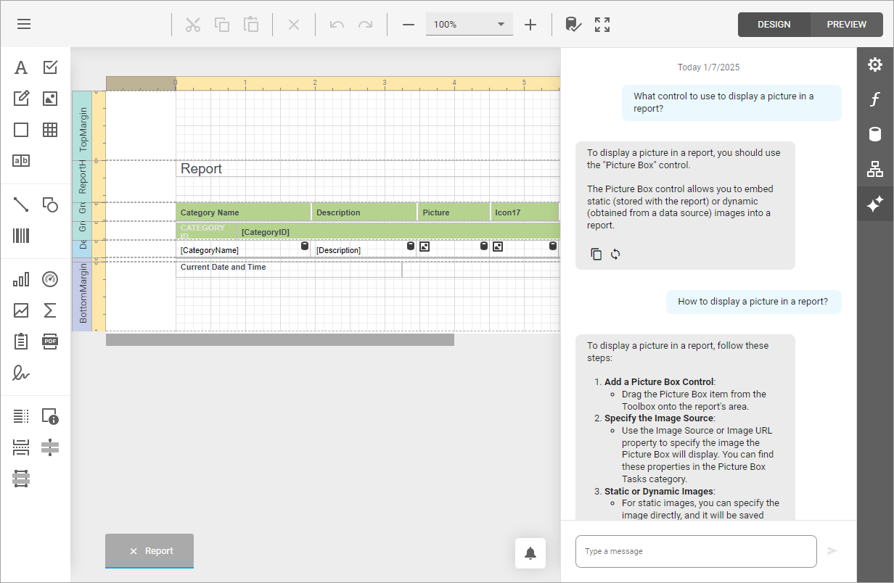

<!-- default badges list -->

[](https://supportcenter.devexpress.com/ticket/details/T1252182)
[](https://docs.devexpress.com/GeneralInformation/403183)
[](#does-this-example-address-your-development-requirementsobjectives)
<!-- default badges end -->
# Reporting for ASP.NET Core - Integrate AI Assistant based on Azure OpenAI

This example is an ASP.NET Core application with integrated DevExpress Reports and an AI assistant. User requests and assistant responses are displayed on-screen using the DevExtreme [`dxChat`](https://js.devexpress.com/jQuery/Documentation/24_2/ApiReference/UI_Components/dxChat/) component.

The AI assistant's role depends on the associated DevExpress Reports component:

- **Data Analysis Assistant**: An assistant for the DevExpress *Web Document Viewer*. This assistant analyzes report content and answers questions related to information within the report.
- **UI Assistant**: An assistant for the DevExpress *Web Report Designer*. This assistant explains how to use the Designer UI to accomplish various tasks. Responses are based on information from [end-user documentation](https://github.com/DevExpress/dotnet-eud) for DevExpress Web Reporting components.

> [!Note]
> We use the following versions of the `Microsoft.Extensions.AI.*` libraries in our source code:
>
> v24.2.6+ | **9.3.0-preview.1.25161.3**
>
> We do not guarantee compatibility or correct operation with higher versions. Refer to the following announcement for additional information: [Microsoft.Extensions.AI.Abstractions NuGet Package Version Upgrade in v24.2.6](https://community.devexpress.com/blogs/news/archive/2025/03/12/important-announcement-microsoft-extensions-ai-abstractions-nuget-package-version-upgrade.aspx).

**Please note that AI Assistant initialization takes time. The assistant tab appears once Microsoft Azure scans the source document on the server side.**

## Implementation Details

### Common Settings

#### Add Personal Keys

> [!NOTE]  
> DevExpress AI-powered extensions follow the "bring your own key" principle. DevExpress does not offer a REST API and does not ship any built-in LLMs/SLMs. You need an active Azure/Open AI subscription to obtain the REST API endpoint, key, and model deployment name. These variables must be specified at application startup to register AI clients and enable DevExpress AI-powered Extensions in your application.

You need to create an Azure OpenAI resource in the Azure portal to use AI Assistants for DevExpress Reporting. Refer to the following help topic for details: [Microsoft - Create and deploy an Azure OpenAI Service resource](https://learn.microsoft.com/en-us/azure/ai-services/openai/how-to/create-resource?pivots=web-portal).

Once you obtain a private endpoint and an API key, register them as `AZURE_OPENAI_ENDPOINT` and `AZURE_OPENAI_APIKEY` environment variables. The [EnvSettings.cs](./CS/ReportingApp/EnvSettings.cs) reads these settings. `DeploymentName` in this file is a name of your Azure model, for example, `GPT4o`:

```cs
public static class EnvSettings {
    public static string AzureOpenAIEndpoint { get { return Environment.GetEnvironmentVariable("AZURE_OPENAI_ENDPOINT"); } }
    public static string AzureOpenAIKey { get { return Environment.GetEnvironmentVariable("AZURE_OPENAI_APIKEY"); } }
    public static string DeploymentName { get { return "GPT4o"; } }
}
```

Files to Review: 
- [EnvSettings.cs](./CS/ReportingApp/EnvSettings.cs)

#### Register AI Services

>[!NOTE]
> The availability of Azure Open AI Assistants depends on region. For additional guidance in this regard, refer to the following document: [Azure OpenAI Service models -- Assistants (Preview)](https://learn.microsoft.com/en-us/azure/ai-services/openai/concepts/models?tabs=global-standard%2Cstandard-chat-completions#assistants-preview).

Register AI services in your application. Add the following code to the _Program.cs_ file:

```cs
using DevExpress.AIIntegration;
using Azure;
using Azure.AI.OpenAI;
using Microsoft.Extensions.AI;
using System;
// ...
var azureOpenAIClient = new AzureOpenAIClient(
    new Uri(EnvSettings.AzureOpenAIEndpoint),
    new AzureKeyCredential(EnvSettings.AzureOpenAIKey));
    
var chatClient = azureOpenAIClient.AsChatClient(EnvSettings.DeploymentName);
builder.Services.AddDevExpressAI(config =>
{
    config.RegisterOpenAIAssistants(azureOpenAIClient, EnvSettings.DeploymentName);
});
```

Files to Review: 
- [Program.cs](./CS/ReportingApp/Program.cs)

#### AI Assistant Provider
 
On the server side, the `AIAssistantProvider` service manages assistants. An `IAIAssistantFactory` instance creates assistants with keys specified in previous steps.
 
```cs
public interface IAIAssistantProvider {
    IAIAssistant GetAssistant(string assistantName);
    Task<string> CreateAssistant(AssistantType assistantType, Stream data);
    Task<string> CreateAssistant(AssistantType assistantType);
    void DisposeAssistant(string assistantName);
}
```

Files to Review: 
- [AIAssistantProvider.cs](./CS/ReportingApp/Services/AIAssistantProvider.cs)
- [IAIAssistantProvider.cs](./CS/ReportingApp/Services/IAIAssistantProvider.cs)


### Web Document Viewer (Data Analysis Assistant)

The following image displays Web Document Viewer UI implemented in this example. The AI Assistant tab uses a `dxChat` component to display requests and responses:



#### Add a New Tab

On the `BeforeRender` event, add a new tab (a container for the assistant interface):

```cshtml
@model DevExpress.XtraReports.Web.WebDocumentViewer.WebDocumentViewerModel
@await Html.PartialAsync("_AILayout")
<script>
    let aiTab;
    function BeforeRender(sender, args) {
        const previewModel = args;
        const reportPreview = previewModel.reportPreview;

        aiTab = createAssistantTab();
        const model = aiTab.model;
        previewModel.tabPanel.tabs.push(aiTab);
        // ...
    }
</script>

@{
    var viewerRender = Html.DevExpress().WebDocumentViewer("DocumentViewer")
        .Height("100%")
        .ClientSideEvents(configure => {
            configure.BeforeRender("BeforeRender");
        })
        .Bind(Model);
    @viewerRender.RenderHtml()
}
@* ... *@
```

#### Access the Assistant

Once the document is ready, the `DocumentReady` event handler sends a request to the server and obtains the assistant's ID:

```js
async function DocumentReady(sender, args) {
    const response = await sender.PerformCustomDocumentOperation(null, true);
    if (response.customData && aiTab?.model) {
        aiTab.model.chatId = response.customData;
        aiTab.visible = true;
    }
}
```

The [`PerformCustomDocumentOperation`](https://docs.devexpress.com/XtraReports/js-ASPxClientWebDocumentViewer?p=netframework#js_aspxclientwebdocumentviewer_performcustomdocumentoperation) method exports the report to PDF and creates an assistant based on the exported document. See [AIDocumentOperationService.cs](./CS/ReportingApp/Services/AIDocumentOperationService.cs) for implementation details.

#### Communicate with the Assistant

Each time a user sends a message, the [`onMessageEntered`](https://js.devexpress.com/jQuery/Documentation/24_2/ApiReference/UI_Components/dxChat/Configuration/#onMessageEntered) event handler passes the request to the assistant:

```js
//...
async function getAIResponse(text, id) {
    const formData = new FormData();
    formData.append('text', text);
    formData.append('chatId', id);
    lastUserQuery = text;
    const response = await fetch(`/AI/GetAnswer`, {
        method: 'POST',
        body: formData
    });
    return await response.text();
}
// ...
function RenderAssistantMessage(instance, message) {
    instance.option({ typingUsers: [] });
    instance.renderMessage({ timestamp: new Date(), text: message, author: assistant.name, id: assistant.id });
}
// ...
onMessageEntered: async (e) => {
    const instance = e.component;
    instance.renderMessage(e.message);
    instance.option({ typingUsers: [assistant] });
    const userInput = e.message.text;

    var response = await getAIResponse(userInput, assistant.id);
    RenderAssistantMessage(instance, response);
}
// ...
```

`AIController.GetAnswer` receives answers from the assistant.

#### Files to Review:

- [DocumentViewer.cshtml](./CS/ReportingApp/Views/Home/DocumentViewer.cshtml)
- [AIDocumentOperationService.cs](CS/ReportingApp/Services/AIDocumentOperationService.cs)
- [AIController.cs](./CS/ReportingApp/Controllers/AIController.cs)
- [aiIntegration.js](./CS/ReportingApp/wwwroot/js/aiIntegration.js)

### Web Report Designer (UI Assistant)

The following image displays Web Report Designer UI implemented in this example. The AI Assistant tab uses a `dxChat` component to display requests and responses:



#### Add a New Tab

On the `BeforeRender` event, add a new tab (a container for the assistant interface):

```cshtml
@model DevExpress.XtraReports.Web.ReportDesigner.ReportDesignerModel
<script>
    async function BeforeRender(sender, args) {

        const tab = createAssistantTab(chatId);
        args.tabPanel.tabs.push(tab);
    }
</script>

@await Html.PartialAsync("_AILayout")
@{
    var designerRender = Html.DevExpress().ReportDesigner("reportDesigner")
        .Height("100%")
        .ClientSideEvents(configure => {
            configure.BeforeRender("BeforeRender");
        })
        .Bind(Model);
    @designerRender.RenderHtml()
}

@section Scripts {
    @* ... *@
    <script src="~/js/aiIntegration.js"></script>
    @designerRender.RenderScripts()
}
@* ... *@
```

#### Access the Assistant

On the `BeforeRender` event, send a request to `AIController` to create the assistant:

```js
async function BeforeRender(sender, args) {
    const result = await fetch(`/AI/CreateUserAssistant`);
}
```

The `AIAssistantProvider` service creates an assistant using the provided PDF documentation (the *documentation.pdf* file):

```cs
// ...
public async Task<string> CreateAssistant(AssistantType assistantType, Stream data) {
    var assistantName = Guid.NewGuid().ToString();
    var assistant = await assistantFactory.CreateAssistant(assistantName);
    Assistants.TryAdd(assistantName, assistant);
    var prompt = GetPrompt(assistantType);
    if(assistantType == AssistantType.UserAssistant) {
        await LoadDocumentation(assistant, prompt);
    } 
    return assistantName;
}
```
#### Communicate with the Assistant

Each time a user sends a message, the [`onMessageEntered`](https://js.devexpress.com/jQuery/Documentation/24_2/ApiReference/UI_Components/dxChat/Configuration/#onMessageEntered) event handler passes the request to the assistant:

```js
//...
async function getAIResponse(text, id) {
    const formData = new FormData();
    formData.append('text', text);
    formData.append('chatId', id);
    lastUserQuery = text;
    const response = await fetch(`/AI/GetAnswer`, {
        method: 'POST',
        body: formData
    });
    return await response.text();
}
// ...
function RenderAssistantMessage(instance, message) {
    instance.option({ typingUsers: [] });
    instance.renderMessage({ timestamp: new Date(), text: message, author: assistant.name, id: assistant.id });
}
// ...
onMessageEntered: async (e) => {
    const instance = e.component;
    instance.renderMessage(e.message);
    instance.option({ typingUsers: [assistant] });
    const userInput = e.message.text;

    var response = await getAIResponse(userInput, assistant.id);
    RenderAssistantMessage(instance, response);
}
// ...
```

`AIController.GetAnswer` receives answers from the specified assistant.

#### Files to Review:

- [ReportDesigner.cshtml](./CS/ReportingApp/Views/Home/ReportDesigner.cshtml)
- [AIDocumentOperationService.cs](./CS/ReportingApp/Services/AIDocumentOperationService.cs)
- [AIController.cs](./CS/ReportingApp/Controllers/AIController.cs)
- [aiIntegration.js](./CS/ReportingApp/wwwroot/js/aiIntegration.js)

## Documentation 

- [AI-powered Extensions for DevExpress Reporting](https://docs.devexpress.com/XtraReports/405211/ai-powered-functionality/ai-for-devexpress-reporting?v=24.2)

## More Examples

- [DevExtreme Chat - Getting Started](https://github.com/DevExpress-Examples/devextreme-getting-started-with-chat)
- [Reporting for ASP.NET Core - Summarize and Translate DevExpress Reports Using Azure OpenAI](https://github.com/DevExpress-Examples/reporting-asp-net-core-ai-summarize-and-translate)
- [Reporting for Blazor - Integrate AI-powered Summarize and Translate Features based on Azure OpenAI](https://github.com/DevExpress-Examples/blazor-reporting-ai/)
- [AI Chat for Blazor - How to add DxAIChat component in Blazor, MAUI, WPF, and WinForms applications](https://github.com/DevExpress-Examples/devexpress-ai-chat-samples)
- [Rich Text Editor and HTML Editor for Blazor - How to integrate AI-powered extensions](https://github.com/DevExpress-Examples/blazor-ai-integration-to-text-editors)

<!-- feedback -->
## Does this example address your development requirements/objectives?

[](https://www.devexpress.com/support/examples/survey.xml?utm_source=github&utm_campaign=web-reporting-integrate-ai-assistant&~~~was_helpful=yes) [](https://www.devexpress.com/support/examples/survey.xml?utm_source=github&utm_campaign=web-reporting-integrate-ai-assistant&~~~was_helpful=no)

(you will be redirected to DevExpress.com to submit your response)
<!-- feedback end -->
